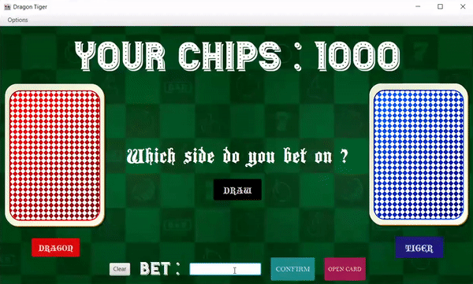

# Programming Assignment 4
## Dragon Tiger Game

*by Pitchapa Sae-lim*

### Introduction
    
Dragon Tiger Game is about as simple as gambling gets. It is basically a two-card version of baccarat. To be more specific, two cards are drawn, one to the Dragon and one to the Tiger. The player bets on which one will be higher. There are also some proposition bets on the individual cards. The game is rumored to be found in Cambodia.

### UML class diagram of Dragon Tiger Game

### How to play Dragon Tiger Game

    First, you should bet on Dragon or Tiger or Draw. Then, you enter the amount of chips that you wants to bet. After that, click the confirm and opens the card.
      
               ♠ Dragon is higher than Tiger. ♠

                   ♣ If you bet on Dragon, you win and receive chips from your bet.
                   ♣ If you bet on Tiger, you lose and lose chips from your bet.
                   ♣ If you bet on Draw, you lose and lose chips from your bet.

                ♠ Tiger is higher than Dragon. ♠
      
                    ♣ If you bet on Dragon, you lose and lose chips from your bet.
                    ♣ If you bet on Tiger, you win and receive chips from your bet.
                    ♣ If you bet on Draw, you lose and lose chips from your bet. 

                 ♠ Dragon is the same as Tiger. 

                    ♣ If you bet on Dragon, you lose and lose half of chips from your bet.
                    ♣ If you bet on Tiger, you lose and lose half of chips from your bet.
                    ♣ If you bet on Draw,  you win and receive chips from your bet.

                                  Sorting the cards from highest to lowest :
                              K > Q > J > 10 > 9 > 8 > 7 > 6 > 5 > 4 > 3 > 2 > A
   
                         * Suppose that “A” is equal to 1 and suit has no effect. *

### How to run JAR file.

* Open the command line window.

* Change directory to the directory that contain `JAR file`.

* The command is:

    > java -jar DragonTigerGame.jar

    *For Java 11 you need to specify the module path for JavaFX. Enter:*

    > java --module-path /path/to/javafx11/lib/ --add-modules javafx.controls -jar DragonTigerGame.jar

### How to run Dragon Tiger Game in code editor

* Open code editor.

* Run `DragonTigerGame.java`

